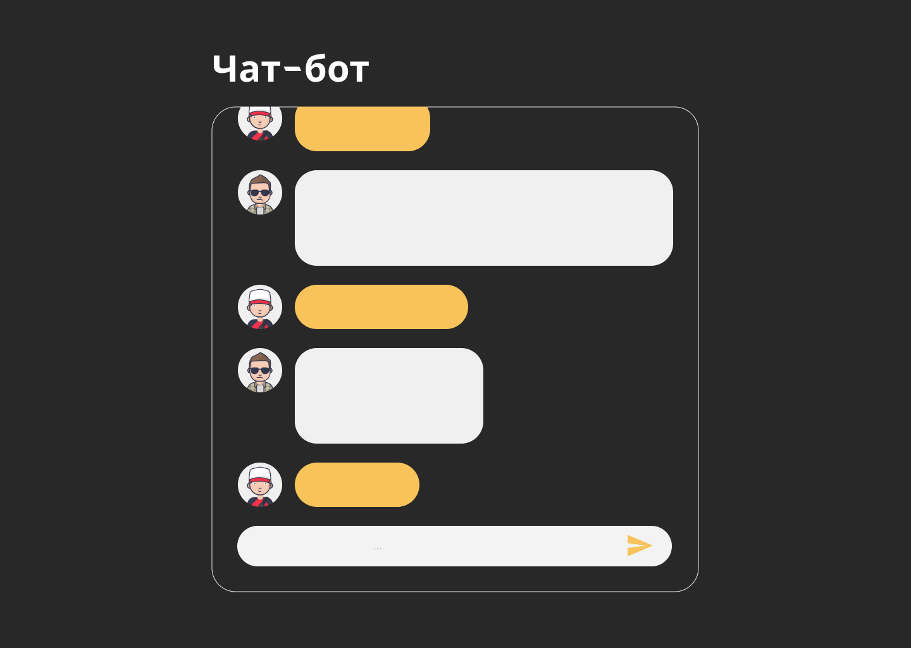
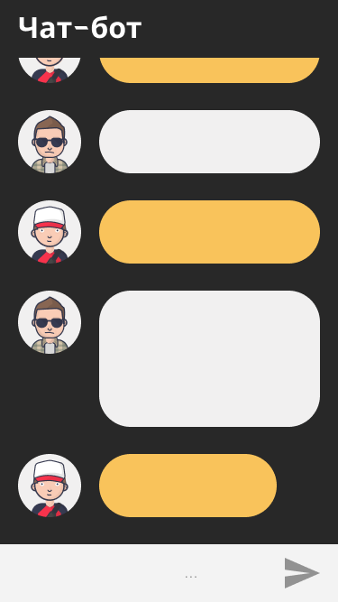

# BeeInterns-01-test-
# &lt;Тестовое задание по JavaScript/>

## Требования 

Для проверки задания необходимо прислать ссылку на репозиторий с проектом. Проект должен содержать REDME.md, который будет содержать обоснования выбора инструментов для реализации задания.

## Техническое задание

Необходимо написать Чат-бота, который будет считать простые числа и выводить результат в окно чата. Чат должен быть адаптивным под все устройства. Чат-бот может быть реализован с помощью любого выбранного инструмента на JavaScript. Выполнение задание со звездочкой приветствуется, но не является обязательным.

## Ссылка на макет 
<u>Перейти к [макету](https://www.figma.com/file/Ztm9QXAkGD5NSrOaleuCTz/chatbot?node-id=0%3A1)</u>

## Описание чат-бота
- Чат должен идти снизу вверх
- Чат должен быть адаптивным под все экраны, максимальная ширина чата на desktop должна быть 700px
- При пустом поле ввода сообщения, кнопка «отправить» должна быть не активна. После ввода одного и более символов кнопка меняет свой цвет на желтый становясь кликабельной
- Баблик с отправленным сообщением должно менять размер в зависимости от кол-ва текста
- При вводе большого кол-ва текста, высота поля ввода сообщения не должна меняться
- При вводе сообщения, должна выводиться анимация в виде троеточия
- Команды для чат-бота:
    * /start — начало общения с чат ботом. Ответ: «Привет, меня зовут Чат-бот, а как зовут тебя?». Если ввели другое значение, чат-бот должен отвечать: «Введите команду /start, для начала общения»
    * /name: Alex — ответ: «Привет Alex, приятно познакомится. Я умею считать, введи числа которые надо посчитать»
    * /number: 7, 9
    * После ввода чисел Чат-бот должен предложить ввести одно из действий: -, +, *, /
    * После ввода действия, Чат-бот возвращает результат
    * /stop — Ответ Чат-бота: «Всего доброго, если хочешь поговорить пиши /start»
- Если была введена команда не указанная в ТЗ, Чат-бот должен ответить: «Я не понимаю, введите другую команду!»
- При вводе команды /weather Чат-бот должен идти на любой сайт с погодой, брать погоду на завтра, и выводить ее в чат. Оформление вывода погоды индивидуально.

  
  

